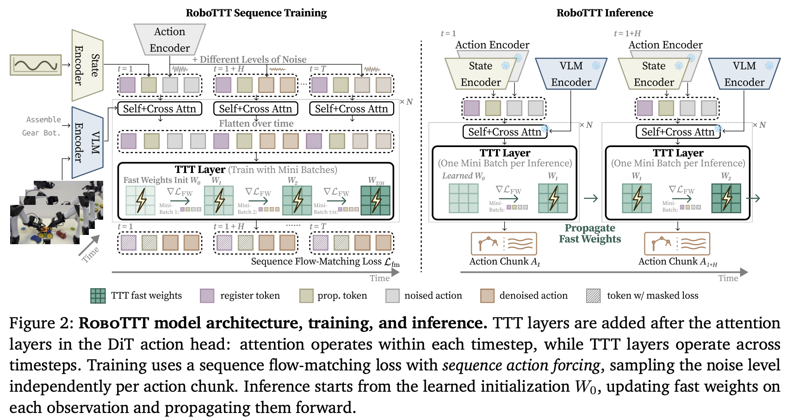

</img>

## RoboTTT (wip)

Implementation of [RoboTTT](https://research.nvidia.com/labs/gear/robottt/) proposed by Yunfan Jiang et al. of Stanford and Nvidia.

## Install

```bash
pip install robo-ttt
```

## Usage

### Basic Usage

Using `MemoryKeyValueBind` and `TTTWrapper` standalone with a 2-layer MLP memory:

```python
import torch
from torch import nn

from robo_ttt import MemoryKeyValueBind, TTTWrapper

memory_network = nn.Sequential(
    nn.Linear(512, 1024),
    nn.GELU(),
    nn.Linear(1024, 512)
)

memory = MemoryKeyValueBind(512, memory_network)
ttt_wrapper = TTTWrapper(512, memory = memory)

# attended action tokens for multiple action chunks over time (batch = 2, time = 5, seq_len = 4, dim = 512)
# TTT-KVB is placed at the output of attention layers in the action transformer

attended_action_chunks = torch.randn(2, 5, 4, 512)

out, next_fast_weights, _ = ttt_wrapper(attended_action_chunks)

assert out.shape == attended_action_chunks.shape
```

### Full Policy Wrapper with MimicVideo

Wrapping a policy model (e.g. `MimicVideo`) with `RoboTTT`:

```python
import torch
from torch import nn

from mimic_video import MimicVideo
from robo_ttt import RoboTTT, MemoryKeyValueBind, TTTWrapper

memory_network = nn.Sequential(
    nn.Linear(512, 1024),
    nn.GELU(),
    nn.Linear(1024, 512)
)

memory = MemoryKeyValueBind(512, memory_network)
ttt_wrapper = TTTWrapper(512, memory = memory)

policy = MimicVideo(
    dim = 512,
    dim_video_hidden = 512,
    depth = 2,
    dim_head = 64,
    heads = 8,
    dim_action = 4,
    dim_joint_state = 4
)

model = RoboTTT(
    policy,
    ttt_wrapper = ttt_wrapper,
    ttt_module_paths = ('to_action_tokens',),
    batch_time_arg = 'video_hiddens',
    expand_time_args = ('prompt_token_ids',),
    times_arg = 'time'
)

# inputs for sequence of t = 3 timesteps (batch = 2, time = 3)

video_hiddens = torch.rand(2, 3, 5, 512)
joint_state = torch.randn(2, 3, 4)
actions = torch.randn(2, 3, 32, 4)
prompt_token_ids = torch.tensor([[10, 20, 30, -1], [15, 25, -1, -1]])

# forward training pass with loss masking

loss_mask = torch.tensor([[True, False, True], [False, True, True]])

loss = model(
    prompt_token_ids = prompt_token_ids,
    video_hiddens = video_hiddens,
    actions = actions,
    joint_state = joint_state,
    loss_mask = loss_mask
)

loss.backward()

# sampling / rollout one timestep at a time (auto_unsqueeze_time defaults to True)

init_video_hiddens = torch.randn(2, 5, 512)
init_joint_state = torch.randn(2, 4)

actions_t1, fast_weights1 = model.sample(
    prompt_token_ids = prompt_token_ids,
    video_hiddens = init_video_hiddens,
    joint_state = init_joint_state,
    steps = 4,
    batch_size = 2,
    auto_unsqueeze_time = True,
    return_fast_weights = True
)
```

## Citations

```bibtex
@article{jiang2026robottt0,
    title   = {RoboTTT: Context Scaling for Robot Policies},
    author  = {Yunfan Jiang and Yevgen Chebotar and Ruijie Zheng and Fengyuan Hu and Yunhao Ge and Jimmy Wu and Tianyuan Dai and Scott Reed and Li Fei-Fei and Yuke Zhu and Linxi "Jim" Fan},
    year    = {2026},
    journal = {arXiv preprint arXiv: 2607.15275}
}
```
